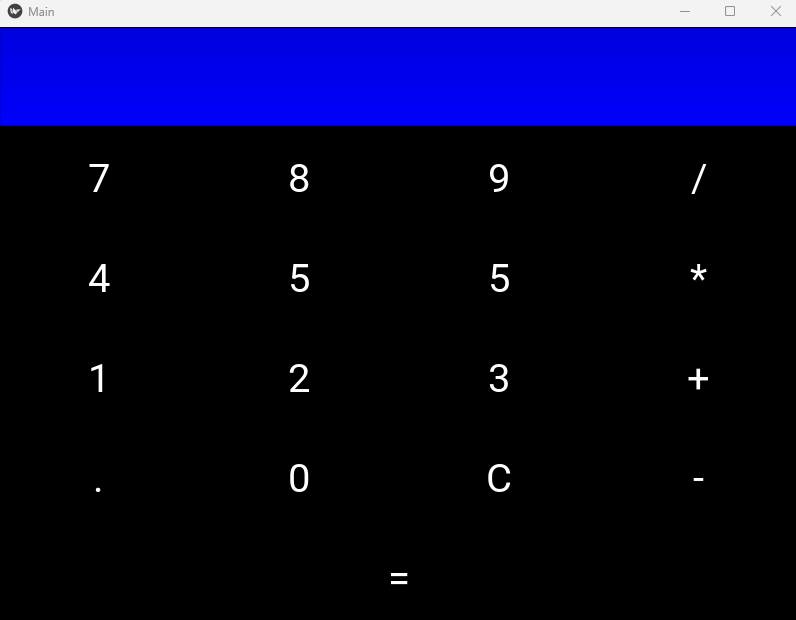
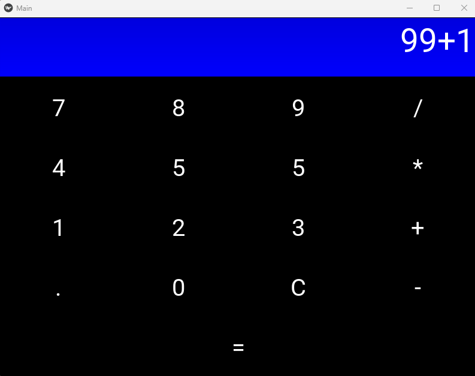
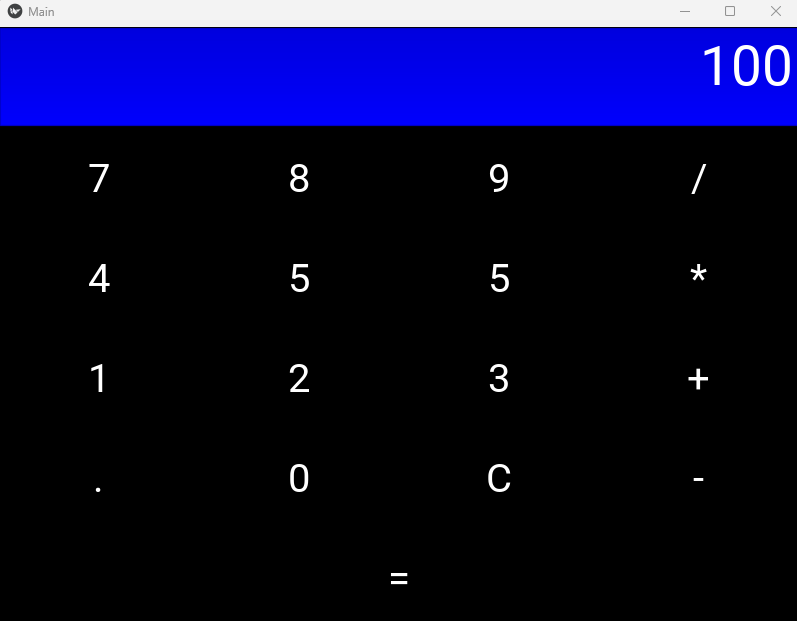

# Python-Kivy-Mobile App
 


## What I Learned/Project Covers

```
- Python App development
- Using Python to create Mobile Apps and/or EXE files
- How to use Kivy and kivymd
- Beautiful design in kivy.
- Labels, layouts, images etc.
```


## Pictures

Calculator Screen:

 

Addition Screen:

 

Total Screen:

 


## Setup 

Make sure you have the latest version of Python installed.


## Viewing The App

Download and Run EXE File in `EXE Folder called "Main"`
